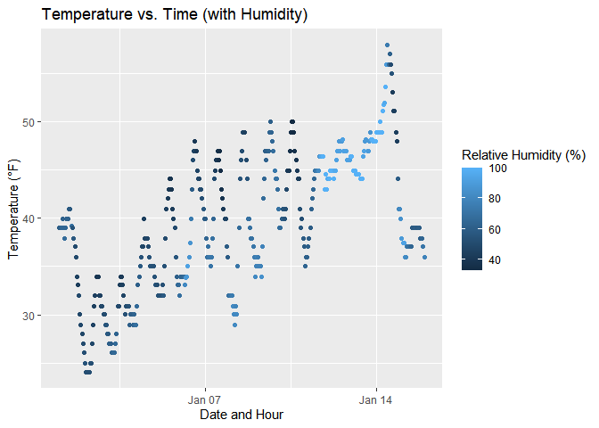

P8105 HOMEWORK 1
================
Anu Singh
2025-09-20

## PROBLEM 1

Loading the required library, and displaying portion of dataset below.

``` r
library("moderndive")
data("early_january_weather")
head(early_january_weather)
```

    ## # A tibble: 6 × 15
    ##   origin  year month   day  hour  temp  dewp humid wind_dir wind_speed wind_gust
    ##   <chr>  <int> <int> <int> <int> <dbl> <dbl> <dbl>    <dbl>      <dbl>     <dbl>
    ## 1 EWR     2013     1     1     1  39.0  26.1  59.4      270      10.4         NA
    ## 2 EWR     2013     1     1     2  39.0  27.0  61.6      250       8.06        NA
    ## 3 EWR     2013     1     1     3  39.0  28.0  64.4      240      11.5         NA
    ## 4 EWR     2013     1     1     4  39.9  28.0  62.2      250      12.7         NA
    ## 5 EWR     2013     1     1     5  39.0  28.0  64.4      260      12.7         NA
    ## 6 EWR     2013     1     1     6  37.9  28.0  67.2      240      11.5         NA
    ## # ℹ 4 more variables: precip <dbl>, pressure <dbl>, visib <dbl>,
    ## #   time_hour <dttm>

The early_january_weather dataset contains hourly meteorological data
from Newark Liberty International Airport (EWR) for January 1st to 15th
in 2013. While the R help documentation mentions that the dataset
includes data from three NYC airports (EWR, LGA, and JFK), a quick look
at the origin column using unique() reveals only EWR data is present.

The dataset includes 358 rows and 15 columns, with the key
variables/measurements including:

- temp - temperature in degrees Fahrenheit
- dewp - dewpoint in degrees Fahrenheit
- humid - relative humidity (percentage)
- wind_dir - wind direction in degrees
- wind_speed - wind speed in miles per hour
- wind_gust - wind gust speed in miles per hour
- precip - precipitation in inches
- pressure - sea level pressure in millibars
- visib - visibility in miles
- time_hour - date and hour of recording (POSIXct format)

The mean temperature during January 2013 was 39.58 degrees Fahrenheit.

Using ggplot() from the tidyverse library, a scatterplot of time
vs. temperature was created.

``` r
library(tidyverse)
scatterplot_temperature = ggplot(early_january_weather, 
       aes(x = time_hour, y = temp, color = humid )) + 
    geom_point() +
  labs(title = "Temperature vs. Time (with Humidity)",
       x = "Date and Hour",
       y = "Temperature (°F)",
       color = "Relative Humidity (%)" )
scatterplot_temperature
```

<!-- -->

From observing the scatterplot, an upward trend is apparent, as days
progressed from early January to mid-January, the temperature generally
increased.An oscillating pattern is also visible from the plot, where
temperatures typically rise during daytime, and fall during night. There
is no distinct trend with humidity, but it appears that humidity
decreases at higher temperatures (noticeable at peaks in the graph).

The plot created has been saved in the project directory as a PNG file.

``` r
ggsave("scatterplot_temperature.png", plot = scatterplot_temperature)
```

## PROBLEM 2
